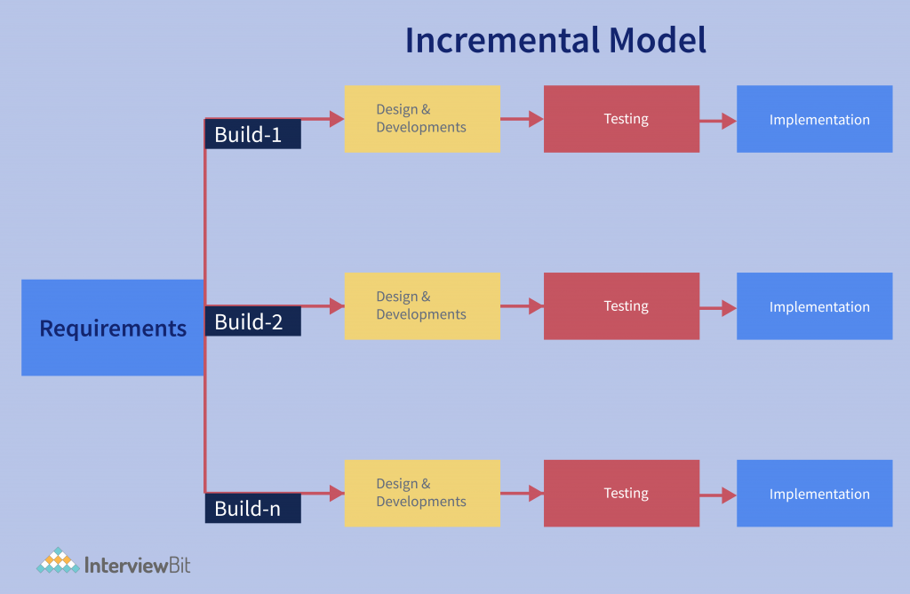

# 📌 **Incremental Model in Software Engineering**

The **Incremental Model** is an SDLC approach where the software is developed and delivered in **small, manageable parts (increments)** instead of building the entire system at once.

👉 Think of it like **building a house room by room**: first living room, then kitchen, then bedrooms… until the full house is complete. Each increment adds more functionality.

---

## 🔄 **Process of Incremental Model**

1. **Requirements Analysis**

   * Gather the overall requirements of the system.
   * Not all details are needed at the start; can refine later.

2. **System Design**

   * Break the system into modules/increments.

3. **Implementation of First Increment**

   * Build the core/basic version with essential features.

4. **Testing & Delivery**

   * Test the first increment and deliver it to users.

5. **Feedback & Enhancement**

   * Collect feedback from users, refine requirements.

6. **Next Increments**

   * Add new features or improvements in each cycle until the final product is ready.

---

## ✅ **Advantages of Incremental Model**

* **Early Delivery** → Users get a working product quickly (even if it’s basic).
* **Flexibility** → Easy to handle changes in requirements during development.
* **Risk Reduction** → Errors can be detected early in each increment.
* **Customer Satisfaction** → Continuous feedback ensures the system meets user needs.
* **Parallel Development Possible** → Different increments can be developed by different teams.
* **Cost Management** → Customer can prioritize increments based on budget.

---

## ❌ **Disadvantages of Incremental Model**

* **Requires Clear Planning** → Splitting the system into increments is not always easy.
* **Integration Issues** → Combining increments may cause compatibility or performance problems.
* **Management Overhead** → More effort in planning, design, and tracking each increment.
* **Not Good for Small Projects** → The overhead may outweigh benefits.
* **Final System Delivery Takes Time** → Customer may get impatient waiting for all features.

---

## 📊 **Best Used When**

* Requirements are partially known at the start and may evolve.
* Large, complex projects where early delivery of core features is important.
* Systems that can be delivered in usable modules (e.g., banking software, e-commerce apps).

---

## 🏗️ Example

Suppose you are building an **E-commerce website**:

* **Increment 1** → User login, product search.
* **Increment 2** → Shopping cart & checkout.
* **Increment 3** → Payment gateway integration.
* **Increment 4** → Order tracking & reviews.

Each increment adds new features while keeping the system usable.

---

👉 **In short:**
The **Incremental Model** builds software piece by piece. It delivers value early, adapts to change, and reduces risk — but requires strong planning and careful integration.
