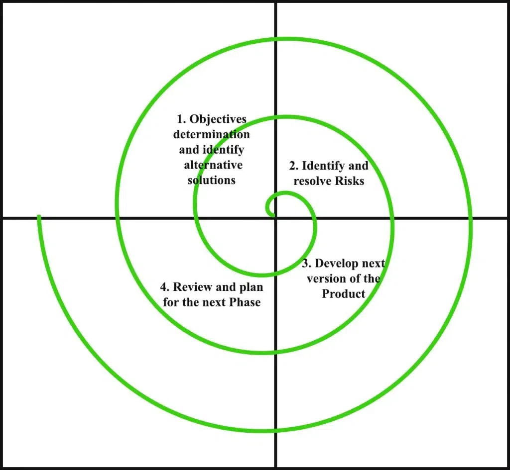

# 📌 **Spiral Model**

The **Spiral Model** is an **evolutionary software development process model** that combines elements of the **Waterfall Model** and **Prototyping Model**, with an added emphasis on **risk analysis**.

👉 It is represented as a **spiral (a looping curve)**, where each loop (cycle) represents a **phase of development**. With each loop, the software evolves into a more complete version.

It was introduced by **Barry Boehm** in 1986.

---

## 🔄 **Phases of Spiral Model**

Each loop of the spiral has **4 main phases**:

1. **Planning Phase**

   * Gather requirements.
   * Define objectives, alternatives, and constraints.

2. **Risk Analysis Phase**

   * Identify risks (technical, cost, schedule, user acceptance, etc.).
   * Analyze and try to resolve or minimize these risks (through simulations, prototypes, research).

3. **Engineering (Development) Phase**

   * Actual design, coding, and testing of the software increment.
   * A working version is built in each cycle.

4. **Evaluation (Customer Feedback) Phase**

   * Customer reviews the system.
   * Feedback is collected for the next cycle.

🔁 The process repeats, with each loop producing a better, more refined version of the system until the final product is delivered.

---

## ✅ **Advantages of Spiral Model**

* **Risk Handling** → Best model for projects with high risks. Risks are identified and managed in each cycle.
* **Flexibility** → Adapts easily to requirement changes.
* **Customer Feedback** → Users are involved in every cycle, ensuring the system meets expectations.
* **Early Detection of Problems** → Since risk analysis is built-in, major issues can be caught early.
* **Large & Complex Projects** → Suitable for big projects where risks are high and requirements may change.

---

## ❌ **Disadvantages of Spiral Model**

* **Expensive** → Risk analysis and repeated cycles add significant cost.
* **Time-Consuming** → More documentation, reviews, and planning → longer development time.
* **Complex Management** → Requires skilled project managers with expertise in risk analysis.
* **Not Good for Small Projects** → Overhead costs are too high for small, low-risk systems.
* **Undefined End** → If not controlled properly, the project may keep looping endlessly (scope creep).

---

## 📊 **Best Used When**

* Projects are **large, complex, and high-risk** (e.g., defense, aerospace, banking).
* Requirements are unclear or expected to change often.
* Risk analysis is critical to success.

---

## 🏗️ **Example**

Suppose you are developing an **Air Traffic Control System**:

* **Loop 1** → Gather basic requirements + identify risks (safety risks, response time).
* **Loop 2** → Build prototype radar screen + test safety risks.
* **Loop 3** → Add communication system + run simulations.
* **Loop 4** → Add flight scheduling + integrate system.
  Each cycle manages risks and produces a more complete system.

---

👉 **In short:**
The **Spiral Model** is like building software in **loops**. Each loop has **planning, risk analysis, development, and customer feedback**. It is best for **large, high-risk projects**, but is **expensive and complex** to manage.

---
---
---

This is the part that often confuses students. Let’s break the **Spiral Model** down again, and I’ll explain **when and how the product actually ends**.

---

# 🔄 Spiral Model Revisited

Imagine a spiral-shaped curve. Each **loop** (cycle) of the spiral represents one **phase of software development**.

## 📌 Each loop has 4 stages:

1. **Planning** → Define goals, requirements.
2. **Risk Analysis** → Identify risks, evaluate alternatives, make decisions.
3. **Engineering** → Design, code, test (a part of the product).
4. **Customer Evaluation** → Get feedback and approve for the next loop.

---

## 🏗️ How does the product grow?

* In the **first loop**, you might only build a **prototype** or a **basic core version**.
* In the **next loops**, you add more features or refine the system.
* With every loop, the system becomes **more complete and closer to the final product**.

👉 The spiral keeps going until the product is **complete enough** and meets the user’s requirements.
👉 At that point, the project exits the spiral — and the **final system is delivered**.

So, the **end point** of the spiral is not infinite — it’s when:

* All requirements are implemented,
* All major risks are resolved,
* The customer accepts the system as “done.”

---

## 🎯 Think of it like this:

* **Waterfall**: Build the whole house in one go.
* **Incremental**: Build the house room by room.
* **Spiral**: Build the house room by room, **but before each room**, check the risks (budget, safety, design flaws), build it, show it to the owner, and then move to the next room.

The spiral **ends when the whole house is ready and the owner is satisfied** ✅.

---

## ✨ Why Spiral is Special

The spiral model **doesn’t assume a fixed number of loops**. The number of cycles depends on:

* Project size and complexity,
* How many risks must be resolved,
* Customer’s changing needs.

For small projects → maybe **2–3 loops** are enough.
For very large systems → can take **10+ loops** before final delivery.

---

👉 **In short:**
The product **does not go on forever**. The spiral repeats until the software is complete and all risks are under control. Each loop adds features + reduces risk, and the last loop gives the **final system**.
